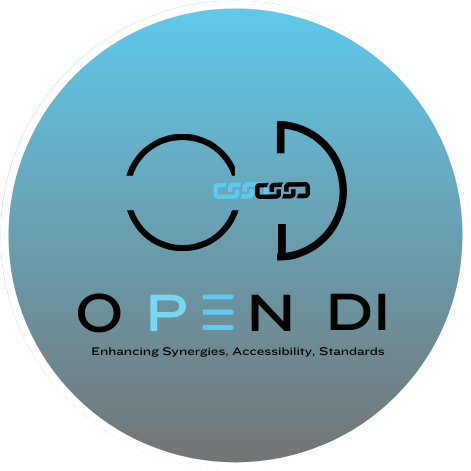

# Welcome to OpenDI

Welcome! You're currently browsing source files for the OpenDI public website - JSON Schema.

## Get started

If you're looking to explore the standards or learn more about the project, [start on the website.](https://opendi-org.github.io/landing-site/)  
If you'd like to go to the JSON Schema website directly, use [this direct link](https://opendi-org.github.io/json-schema)

If you'd like to contribute to OpenDI, check the [contribution guide.](https://opendi-org.github.io/landing-site/How%20To%20Contribute/)

Want to engage in community discussion? Join the [OpenDI Discord server!](https://discord.gg/FtAX3JStJz)

# Getting up to speed

A good way to get familiar with the schema is to browse some test data. See `test-data.json`.  
Ideally, clone the repo to a dev environment that has JSON Schema integration, like VS Code. See instructions below.

Alternatively, there is static HTML documentation in `docs/schema_docs.html`.  
These docs pull information directly from the schema and presents it in a more readable format. 

## VS Code

1. Clone the repository to a local folder.
2. Open the repository folder VS Code.
3. In VS Code, open `test-data.json`.
4. Hover over portions of the test data to see popups for the title and description information included in the schema.
5. Try adding to the test data. Use the [Problems Panel](https://code.visualstudio.com/docs/editor/editingevolved#_errors-warnings) to see what changes would bring your data into schema compliance (missing/malformed fields, etc).

# Resources Used

The OpenDI JSON Schema definition is based on the Schema specifications managed by [JSON-Schema.org](https://json-schema.org/).

Static HTML documentation is generated with [JSON Schema For Humans](https://github.com/coveooss/json-schema-for-humans).
